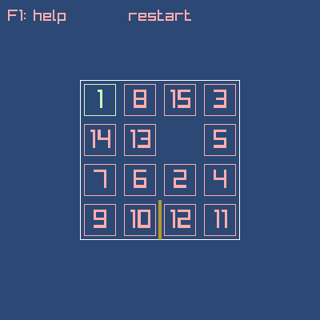

# zig15game
A [zig](https://ziglang.org/download/) 15 puzzle game based on [15 puzzle game](https://ziggit.dev/t/15-puzzle-game/4350) by Chris Boesch,  
changed from a console/terminal implementation to a [raylib](https://www.raylib.com/) implementation.

Added simple raylib gui and sound effects.  
If you are a vim user (or want to train vim keys) play with hjkl, otherwise use wasd or arrow keys!

## Play

[](https://simonlschlee.github.io/zig15game/)  
https://simonlschlee.github.io/zig15game/

## Discussion
Ziggit topic for discussion: https://ziggit.dev/t/raylib-15-game/5233  
If you have ideas for improvements you can use ziggit or open an issue!

## install
```bash
git clone https://github.com/SimonLSchlee/zig15game.git
cd zig15game
zig build run
```

tested with zig version: `0.13.0`  

## other raylib projects

[zigraylib](https://github.com/SimonLSchlee/zigraylib)
## license
public domain or MIT
